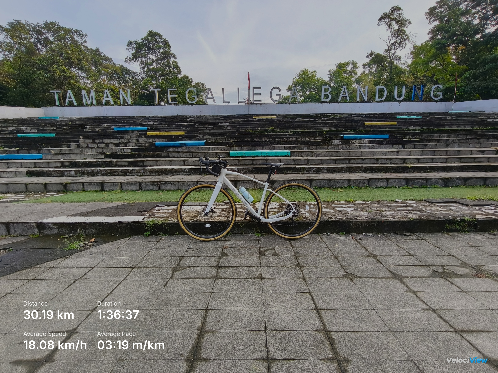

# VelociView

Generate clean, customizable image overlays of your activity stats from GPX or TCX files. Drop in a photo and an activity file, tweak the appearance, and export a polished image ready to share.

**💡 Tip:** We recommend using **GPX files** for best results — they provide more complete elevation data, better GPS accuracy, and wider compatibility across fitness platforms.


[](LICENSE)


---

## Table of Contents

- [Features](#features)
- [Demo](#demo)
- [Quick Start](#quick-start)
- [Usage](#usage)
- [Export Formats](#export-formats)
- [Contributing](#contributing)
- [License](#license)

## Features

- Clean, modern overlay of key stats (distance, time, pace, elevation, etc.)
- Flexible layout: list, auto grid, or fixed columns
- Precise placement with drag-and-drop and positioning presets
- Font selection with preloaded Google Fonts
- Adjustable scale and optional backdrop darkening
- Export to PNG, JPEG, WebP, or copy directly to clipboard
- All processing happens locally in your browser — your files never leave your device

## Demo



## Quick Start

This project uses Svelte 5 and Vite.

```bash
pnpm install
pnpm dev
```

Build and preview:

```bash
pnpm build
pnpm preview
```

## Usage

1. Upload or drag-and-drop a background image.
2. Upload or drag-and-drop a `.gpx` (recommended) or `.tcx` file (e.g., from Garmin/Strava export).
3. Choose which fields to display, then adjust position, layout, and appearance.
4. Export the image or copy it to your clipboard.

### Tips

- Try the different layout modes (list, auto grid, fixed columns) to fit your image.
- Use the scale and backdrop controls to improve legibility over busy photos.
- Position presets are a quick starting point; fine-tune via drag-and-drop.

## Export Formats

- PNG
- JPEG
- WebP
- Copy to clipboard

## Contributing

Issues and pull requests are welcome! If you find a bug or have a feature idea, please open an issue.

## License

MIT
